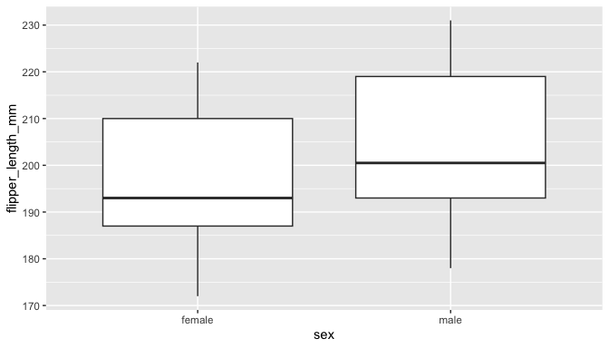

Week 04 Notes
================
Haley Poppinga
2025-09-16

Lecture In-Class: Intro to {dplyr} - a set of verbs for manipulating
data: - filtering rows, selecting columns, grouping by objects, getting
summary statistics, mutating columns, removing NAs

Homework 1. Practice with dplyr

[dplyr cheat
sheet.](https://raw.githubusercontent.com/rstudio/cheatsheets/main/data-transformation.pdf)
Download this now to use as a resource.

| \# Review |
|----|
| \# Intro to the {dplyr} package (part of the TidyVerse) Don’t need to load dplyr. Just TidyVerse |
| \”, width=70% /\> \] |
| Illustrations from the Openscapes blog [Tidy Data for reproducibility, efficiency](https://www.openscapes.org/blog/2020/10/12/tidy-data/), and collaboration by Julia Lowndes and Allison Horst |

# dplyr: verbs for manipulating data

<figure>

<figcaption aria-hidden="true">verbs</figcaption>
</figure>

filtering extracts rows select() extracts columns arrange() mutate()
adds new columns, same length of rows but longer group_by() %\>%
summarize() makes shorter

| \# Penguin data again. |
|----|
| \# Filter |
|  |
| dplyr::filter() call the package name first filter(df, type == “otter” & site == “blah”) |
| == reads as is exactly equal to |

\#Filter \### Extract rows that meet some critera

``` r
#filter(.data = DATA, ...)
```

- DATA = Data frame to transform

- … = One or more criteria  
  filter() returns each row for which the criteria is TRUE

| \# filter only the female penguins \### As always, exact spelling and capitalization matters |
|----|
| \# filter only the female penguins \### As always, exact spelling and capitalization matters |
| After filtering |
| `r filter(.data = penguins, sex == "female" )` |
| `## # A tibble: 165 × 8 ##    species island    bill_length_mm bill_depth_mm flipper_length_mm body_mass_g ##    <fct>   <fct>              <dbl>         <dbl>             <int>       <int> ##  1 Adelie  Torgersen           39.5          17.4               186        3800 ##  2 Adelie  Torgersen           40.3          18                 195        3250 ##  3 Adelie  Torgersen           36.7          19.3               193        3450 ##  4 Adelie  Torgersen           38.9          17.8               181        3625 ##  5 Adelie  Torgersen           41.1          17.6               182        3200 ##  6 Adelie  Torgersen           36.6          17.8               185        3700 ##  7 Adelie  Torgersen           38.7          19                 195        3450 ##  8 Adelie  Torgersen           34.4          18.4               184        3325 ##  9 Adelie  Biscoe              37.8          18.3               174        3400 ## 10 Adelie  Biscoe              35.9          19.2               189        3800 ## # ℹ 155 more rows ## # ℹ 2 more variables: sex <fct>, year <int>` is sex exactly equal to female? argument = .data |

# filter

``` r
filter(.data = penguins, 
       sex == "female" ) #filter keeps every TRUE
```

    ## # A tibble: 165 × 8
    ##    species island    bill_length_mm bill_depth_mm flipper_length_mm body_mass_g
    ##    <fct>   <fct>              <dbl>         <dbl>             <int>       <int>
    ##  1 Adelie  Torgersen           39.5          17.4               186        3800
    ##  2 Adelie  Torgersen           40.3          18                 195        3250
    ##  3 Adelie  Torgersen           36.7          19.3               193        3450
    ##  4 Adelie  Torgersen           38.9          17.8               181        3625
    ##  5 Adelie  Torgersen           41.1          17.6               182        3200
    ##  6 Adelie  Torgersen           36.6          17.8               185        3700
    ##  7 Adelie  Torgersen           38.7          19                 195        3450
    ##  8 Adelie  Torgersen           34.4          18.4               184        3325
    ##  9 Adelie  Biscoe              37.8          18.3               174        3400
    ## 10 Adelie  Biscoe              35.9          19.2               189        3800
    ## # ℹ 155 more rows
    ## # ℹ 2 more variables: sex <fct>, year <int>

One = sets an argument in the function

Two == reads as “is exactly equal to.” It is a question that returns a
TRUE or FALSE. Here, filter keeps every TRUE

| \# A list of logical expressions |
|----|
| \# How would I use filter to… |
| 1\. Penguins measured in the year 2008? |
| `r filter(.data = penguins, year == 2008)` |
| `## # A tibble: 114 × 8 ##    species island bill_length_mm bill_depth_mm flipper_length_mm body_mass_g ##    <fct>   <fct>           <dbl>         <dbl>             <int>       <int> ##  1 Adelie  Biscoe           39.6          17.7               186        3500 ##  2 Adelie  Biscoe           40.1          18.9               188        4300 ##  3 Adelie  Biscoe           35            17.9               190        3450 ##  4 Adelie  Biscoe           42            19.5               200        4050 ##  5 Adelie  Biscoe           34.5          18.1               187        2900 ##  6 Adelie  Biscoe           41.4          18.6               191        3700 ##  7 Adelie  Biscoe           39            17.5               186        3550 ##  8 Adelie  Biscoe           40.6          18.8               193        3800 ##  9 Adelie  Biscoe           36.5          16.6               181        2850 ## 10 Adelie  Biscoe           37.6          19.1               194        3750 ## # ℹ 104 more rows ## # ℹ 2 more variables: sex <fct>, year <int>` |
| 2\. Penguins that have a body mass greater than 5000 |
| `r filter(.data = penguins, body_mass_g > 5000)` |
| `## # A tibble: 61 × 8 ##    species island bill_length_mm bill_depth_mm flipper_length_mm body_mass_g ##    <fct>   <fct>           <dbl>         <dbl>             <int>       <int> ##  1 Gentoo  Biscoe           50            16.3               230        5700 ##  2 Gentoo  Biscoe           50            15.2               218        5700 ##  3 Gentoo  Biscoe           47.6          14.5               215        5400 ##  4 Gentoo  Biscoe           46.7          15.3               219        5200 ##  5 Gentoo  Biscoe           46.8          15.4               215        5150 ##  6 Gentoo  Biscoe           49            16.1               216        5550 ##  7 Gentoo  Biscoe           48.4          14.6               213        5850 ##  8 Gentoo  Biscoe           49.3          15.7               217        5850 ##  9 Gentoo  Biscoe           49.2          15.2               221        6300 ## 10 Gentoo  Biscoe           48.7          15.1               222        5350 ## # ℹ 51 more rows ## # ℹ 2 more variables: sex <fct>, year <int>` |

# Think, pair, share.

Spend 2 minutes to *think* about it. Spend 2 minutes *paired* with a
neighbor to discuss your answers. *Share* with the class.

|  |
|----|
| \# Common mistakes |
| \## Using = instead of == |
| \`\`\` r \#filter(.data = penguins, \# sex = “females”) |
| filter(.data = penguins, sex == “females”) \`\`\` |
| `## # A tibble: 0 × 8 ## # ℹ 8 variables: species <fct>, island <fct>, bill_length_mm <dbl>, ## #   bill_depth_mm <dbl>, flipper_length_mm <int>, body_mass_g <int>, sex <fct>, ## #   year <int>` |
| \## Forgetting quotes |
| \`\`\` r \#filter(.data == penguins, \# sex == females) \#for things that are characters |
| filter(.data = penguins, sex == “females”) \`\`\` |
| `## # A tibble: 0 × 8 ## # ℹ 8 variables: species <fct>, island <fct>, bill_length_mm <dbl>, ## #   bill_depth_mm <dbl>, flipper_length_mm <int>, body_mass_g <int>, sex <fct>, ## #   year <int>` |

# Filter with multiple conditions

Select females that are also greater than 5000 g comma means “and” –\>
do this and that

``` r
filter(.data = penguins, sex == "female", body_mass_g >5000)
```

    ## # A tibble: 5 × 8
    ##   species island bill_length_mm bill_depth_mm flipper_length_mm body_mass_g
    ##   <fct>   <fct>           <dbl>         <dbl>             <int>       <int>
    ## 1 Gentoo  Biscoe           45.1          14.5               207        5050
    ## 2 Gentoo  Biscoe           49.1          14.8               220        5150
    ## 3 Gentoo  Biscoe           44.9          13.3               213        5100
    ## 4 Gentoo  Biscoe           46.5          14.8               217        5200
    ## 5 Gentoo  Biscoe           45.2          14.8               212        5200
    ## # ℹ 2 more variables: sex <fct>, year <int>

|  Boolean operators a & b –\> and a \| b –\> or !a –\> not |
|----|
| \# Default for filter is **&** |
| These do the same exact thing |
| `r filter(.data = penguins, sex == "female", body_mass_g >5000)` |
| `## # A tibble: 5 × 8 ##   species island bill_length_mm bill_depth_mm flipper_length_mm body_mass_g ##   <fct>   <fct>           <dbl>         <dbl>             <int>       <int> ## 1 Gentoo  Biscoe           45.1          14.5               207        5050 ## 2 Gentoo  Biscoe           49.1          14.8               220        5150 ## 3 Gentoo  Biscoe           44.9          13.3               213        5100 ## 4 Gentoo  Biscoe           46.5          14.8               217        5200 ## 5 Gentoo  Biscoe           45.2          14.8               212        5200 ## # ℹ 2 more variables: sex <fct>, year <int>` |
| `r filter(.data = penguins, sex == "female" & body_mass_g >5000)` |
| `## # A tibble: 5 × 8 ##   species island bill_length_mm bill_depth_mm flipper_length_mm body_mass_g ##   <fct>   <fct>           <dbl>         <dbl>             <int>       <int> ## 1 Gentoo  Biscoe           45.1          14.5               207        5050 ## 2 Gentoo  Biscoe           49.1          14.8               220        5150 ## 3 Gentoo  Biscoe           44.9          13.3               213        5100 ## 4 Gentoo  Biscoe           46.5          14.8               217        5200 ## 5 Gentoo  Biscoe           45.2          14.8               212        5200 ## # ℹ 2 more variables: sex <fct>, year <int>` |

# Think, pair, share

Use filter and boolean logical to show: \#always need quotes for calling
a character

1.  Penguins that were collected in *either* 2008 *or* 2009

``` r
filter(.data = penguins, year == 2008 | year == 2009)
```

    ## # A tibble: 234 × 8
    ##    species island bill_length_mm bill_depth_mm flipper_length_mm body_mass_g
    ##    <fct>   <fct>           <dbl>         <dbl>             <int>       <int>
    ##  1 Adelie  Biscoe           39.6          17.7               186        3500
    ##  2 Adelie  Biscoe           40.1          18.9               188        4300
    ##  3 Adelie  Biscoe           35            17.9               190        3450
    ##  4 Adelie  Biscoe           42            19.5               200        4050
    ##  5 Adelie  Biscoe           34.5          18.1               187        2900
    ##  6 Adelie  Biscoe           41.4          18.6               191        3700
    ##  7 Adelie  Biscoe           39            17.5               186        3550
    ##  8 Adelie  Biscoe           40.6          18.8               193        3800
    ##  9 Adelie  Biscoe           36.5          16.6               181        2850
    ## 10 Adelie  Biscoe           37.6          19.1               194        3750
    ## # ℹ 224 more rows
    ## # ℹ 2 more variables: sex <fct>, year <int>

2.  Penguins that *are not* from the island Dream

``` r
filter(.data = penguins, island != "Dream")
```

    ## # A tibble: 220 × 8
    ##    species island    bill_length_mm bill_depth_mm flipper_length_mm body_mass_g
    ##    <fct>   <fct>              <dbl>         <dbl>             <int>       <int>
    ##  1 Adelie  Torgersen           39.1          18.7               181        3750
    ##  2 Adelie  Torgersen           39.5          17.4               186        3800
    ##  3 Adelie  Torgersen           40.3          18                 195        3250
    ##  4 Adelie  Torgersen           NA            NA                  NA          NA
    ##  5 Adelie  Torgersen           36.7          19.3               193        3450
    ##  6 Adelie  Torgersen           39.3          20.6               190        3650
    ##  7 Adelie  Torgersen           38.9          17.8               181        3625
    ##  8 Adelie  Torgersen           39.2          19.6               195        4675
    ##  9 Adelie  Torgersen           34.1          18.1               193        3475
    ## 10 Adelie  Torgersen           42            20.2               190        4250
    ## # ℹ 210 more rows
    ## # ℹ 2 more variables: sex <fct>, year <int>

3.  Penguins in the species Adelie and Gentoo

``` r
filter(.data = penguins, species %in% c("Adelie","Gentoo"))
```

    ## # A tibble: 276 × 8
    ##    species island    bill_length_mm bill_depth_mm flipper_length_mm body_mass_g
    ##    <fct>   <fct>              <dbl>         <dbl>             <int>       <int>
    ##  1 Adelie  Torgersen           39.1          18.7               181        3750
    ##  2 Adelie  Torgersen           39.5          17.4               186        3800
    ##  3 Adelie  Torgersen           40.3          18                 195        3250
    ##  4 Adelie  Torgersen           NA            NA                  NA          NA
    ##  5 Adelie  Torgersen           36.7          19.3               193        3450
    ##  6 Adelie  Torgersen           39.3          20.6               190        3650
    ##  7 Adelie  Torgersen           38.9          17.8               181        3625
    ##  8 Adelie  Torgersen           39.2          19.6               195        4675
    ##  9 Adelie  Torgersen           34.1          18.1               193        3475
    ## 10 Adelie  Torgersen           42            20.2               190        4250
    ## # ℹ 266 more rows
    ## # ℹ 2 more variables: sex <fct>, year <int>

| \# Common mistakes |
|----|
|  Common syntax every dplyr verb function follows |

# mutate: add new columns

\”,
width=70%/\>

| \# mutate  |
|----|
| \# mutate *Create new columns* mutate(.data,…) \* DATA = data frame to transform \* … = columns to make Add a new column converting body mass in g to kg and save the new dataframe |
| \`\`\` r data2\<-mutate(.data = penguins, body_mass_kg = body_mass_g/1000) \#\<\< |
| View(data2) \`\`\` |

### Change multiple columns at once

``` r
data2<-mutate(.data = penguins, 
       body_mass_kg = body_mass_g/1000, #new column
       bill_length_depth = bill_length_mm/bill_depth_mm) #new column

# both data frames now within data2
# first line is convert mass to kg 
# second line is calculate the ratio of bill length to depth

View(data2)
```

| \## Mutating multiple columns at once based on some criteron (i.e. mutate all the numeric columns in one line)? |
|----|
|  ifelse() Do conditional tests within mutate() |
| ifelse(TEST, VALUE_IF_TRUE, VALUE_IF_FALSE) |
| \* TEST = a logical test \* VALUE_IF_TRUE = what happens if test is true \* VALUE_IF_FALSE = what happensif test is false |

# mutate with ifelse

``` r
data2<- mutate(.data = penguins,
               after_2008 = ifelse(year>2008, "After 2008", "Before 2008"))
# if the word is greater than 2008, what 
View(data2)
```

| \# Think, pair, share |
|----|
| \# What if you have multiple verbs that you want to do to the same dataframe? |

# The pipe

# %\>%

## The “pipe” says “and then do”

Dataframe %\>% \# select the dataframe **and then** \> verb1() %\>% \#
do verb 1 **and then**

> verb2() \# do verb 2

| \# %\>% |
|----|
| \# What about this new *native* pipe that I keep seeing on stack exchange? |
| \# %\>% (need to load TidyVerse in order for it to run, more universal than native) \# vs \# \|\> |
| **magrittr** (from the tidyverse) vs **native** (new pipe that comes with base R so you don’t need to load any libraries) |
| In this class I stick with %\>%, but you are welcome to learn and use \|\>, with the understanding that there will be some minor differences in the code. |
| [Please Read Here!](https://r4ds.hadley.nz/data-transform#sec-the-pipe) |

# %\>%

Filter only female penguins and add a new column that calculates the log
body mass  
When you use %\>% the dataframe carries over so you don’t need to write
it out anymore \* pipe and then new line, pipe and then new line,
everything is connected

``` r
penguins %>% # use penguin dataframe
  filter(sex == "female") %>% #select females
  mutate(log_mass = log(body_mass_g)) #calculate log biomass
```

    ## # A tibble: 165 × 9
    ##    species island    bill_length_mm bill_depth_mm flipper_length_mm body_mass_g
    ##    <fct>   <fct>              <dbl>         <dbl>             <int>       <int>
    ##  1 Adelie  Torgersen           39.5          17.4               186        3800
    ##  2 Adelie  Torgersen           40.3          18                 195        3250
    ##  3 Adelie  Torgersen           36.7          19.3               193        3450
    ##  4 Adelie  Torgersen           38.9          17.8               181        3625
    ##  5 Adelie  Torgersen           41.1          17.6               182        3200
    ##  6 Adelie  Torgersen           36.6          17.8               185        3700
    ##  7 Adelie  Torgersen           38.7          19                 195        3450
    ##  8 Adelie  Torgersen           34.4          18.4               184        3325
    ##  9 Adelie  Biscoe              37.8          18.3               174        3400
    ## 10 Adelie  Biscoe              35.9          19.2               189        3800
    ## # ℹ 155 more rows
    ## # ℹ 3 more variables: sex <fct>, year <int>, log_mass <dbl>

| \# Select |
|----|
| \# Select |
| You can also use select() to rename columns. Here, we are renaming species to have a capital S |
| `r penguins %>% # use penguin dataframe filter(sex == "female") %>% #select females mutate(log_mass = log(body_mass_g)) %>% #calculate log biomass select(Species = species, island, sex, log_mass)` |
| `## # A tibble: 165 × 4 ##    Species island    sex    log_mass ##    <fct>   <fct>     <fct>     <dbl> ##  1 Adelie  Torgersen female     8.24 ##  2 Adelie  Torgersen female     8.09 ##  3 Adelie  Torgersen female     8.15 ##  4 Adelie  Torgersen female     8.20 ##  5 Adelie  Torgersen female     8.07 ##  6 Adelie  Torgersen female     8.22 ##  7 Adelie  Torgersen female     8.15 ##  8 Adelie  Torgersen female     8.11 ##  9 Adelie  Biscoe    female     8.13 ## 10 Adelie  Biscoe    female     8.24 ## # ℹ 155 more rows` |

# Summarize

Computer a table of summarized data  
Calculate the mean flipper length (and exclude any NAs)

``` r
 penguins %>% # 
  summarise(mean_flipper = mean(flipper_length_mm, na.rm=TRUE)) #<<
```

    ## # A tibble: 1 × 1
    ##   mean_flipper
    ##          <dbl>
    ## 1         201.

–

Calculate mean and mean flipper length

``` r
 penguins %>% # 
  summarise(mean_flipper = mean(flipper_length_mm, na.rm=TRUE), #<<
            min_flipper = min(flipper_length_mm, na.rm=TRUE))   #<<
```

    ## # A tibble: 1 × 2
    ##   mean_flipper min_flipper
    ##          <dbl>       <int>
    ## 1         201.         172

| \# group_by You can summarize values by certain groups. group_by() by itself doesn’t do anything, but it is powerful when put before summarize. \* use to make bar plots and standard errors in summary statistics |
|----|
| \# group by Groupe by multiple things Group by both island **and** sex |
| `r penguins %>% group_by(island, sex) %>% #<< summarise(mean_bill_length = mean(bill_length_mm, na.rm = TRUE), max_bill_length = max(bill_length_mm, na.rm=TRUE))` |
| `` ## `summarise()` has grouped output by 'island'. You can override using the ## `.groups` argument. `` |
| `## # A tibble: 9 × 4 ## # Groups:   island [3] ##   island    sex    mean_bill_length max_bill_length ##   <fct>     <fct>             <dbl>           <dbl> ## 1 Biscoe    female             43.3            50.5 ## 2 Biscoe    male               47.1            59.6 ## 3 Biscoe    <NA>               45.6            47.3 ## 4 Dream     female             42.3            58 ## 5 Dream     male               46.1            55.8 ## 6 Dream     <NA>               37.5            37.5 ## 7 Torgersen female             37.6            41.1 ## 8 Torgersen male               40.6            46 ## 9 Torgersen <NA>               37.9            42` |
| `r #sumarise() has grouped output by 'island'. you can override using the # .groups argument` |

# remove NAs

drop_na() - drops rows with NAs from a specific column

drop all the rows that are missing data on sex

``` r
penguins %>%
  drop_na(sex) #<<
```

    ## # A tibble: 333 × 8
    ##    species island    bill_length_mm bill_depth_mm flipper_length_mm body_mass_g
    ##    <fct>   <fct>              <dbl>         <dbl>             <int>       <int>
    ##  1 Adelie  Torgersen           39.1          18.7               181        3750
    ##  2 Adelie  Torgersen           39.5          17.4               186        3800
    ##  3 Adelie  Torgersen           40.3          18                 195        3250
    ##  4 Adelie  Torgersen           36.7          19.3               193        3450
    ##  5 Adelie  Torgersen           39.3          20.6               190        3650
    ##  6 Adelie  Torgersen           38.9          17.8               181        3625
    ##  7 Adelie  Torgersen           39.2          19.6               195        4675
    ##  8 Adelie  Torgersen           41.1          17.6               182        3200
    ##  9 Adelie  Torgersen           38.6          21.2               191        3800
    ## 10 Adelie  Torgersen           34.6          21.1               198        4400
    ## # ℹ 323 more rows
    ## # ℹ 2 more variables: sex <fct>, year <int>

| \# remove NAs |
|----|
| \# Pipe into a ggplot You can connect your *data wrangling* to a ggplot with the pipe (you won’t need to call the dataframe in ggplot if you pipe to it). \* pipe straight into ggplot |
| Drop NAs from sex, and then plot boxplots of flipper length by sex |
| `r penguins %>% drop_na(sex) %>% ggplot(aes(x = sex, y = flipper_length_mm)) + #go back to + when in ggplot geom_boxplot()` |
| <!-- --> |
| `r #if you assign something to this it'll be a plot not a data set` |

# Before homeworks… “Totally Awesome R package of the day”

library(devtoosls) \# load the development tools library
devtools::install_github(“jhollist/dadjoke”)

library(dadjoke) dadjoke()

|  |
|----|
| \# Homework |
| Write a script that: |
| 1\. calculates the mean and variance of body mass by species, island, and sex without any NAs |
| 1\. filters out (i.e. excludes) male penguins, then calculates the log body mass, then selects only the columns for species, island, sex, and log body mass, then use these data to make any plot. Make sure the plot has clean and clear labels and follows best practices. Save the plot in the correct output folder. |
| Include both part 1 and part 2 in your script and push it to github in the appropriate folders. |

# Homework

Using the chemistry data: - Create a new clean script - Remove all the
NAs - Separate the Tide_time column into appropriate columns for
analysis - Filter out a subset of data (your choice) - use either
pivot_longer or pivot_wider at least once - Calculate some summary
statistics (can be anything) and export the csv file into the output
folder - Make any kind of plot (it cannot be a boxplot) and export it
into the output folder - Make sure you comment your code and your data,
outputs, and script are in the appropriate folders
