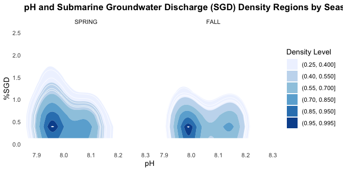

# Week 06 Quarto Homework
Haley Poppinga
2025-10-05

- [Week 06 Homework](#week-06-homework)
  - [Load Libraries](#load-libraries)
  - [Read Data](#read-data)
  - [Make a Plot](#make-a-plot)
  - [Make a Table](#make-a-table)

## Week 06 Homework

**Homework**

- Take any of the data sheets you have already worked with in class and
  create at least one table and one figure in an Quarto file.  
- Create the most beautiful Quarto output you can in either an html,
  github doc, or pdf format. RENDER THE FILE
- Make sure you have headings with clear explanations of what you are
  doing.
- Practice using markdown formatting with bold, italics, and lists (use
  each of these at least once).
- Make sure your outputs and scripts are saved in the appropriate
  folders. Keep proper coding etiquette (figures need to be pub quality
  as usual and you need to comment your code).

### Load Libraries

``` r
library(tidyverse)
library(here)
library(ggplot2)
library(dplyr)
library(tidyr)
library(ghibli) 
library(beepr)
library(kableExtra)
library(tidyplots)
library(akima)
```

### Read Data

``` r
ChemData<-read_csv(here("Week_04","data", "chemicaldata_maunalua.csv"))
glimpse(ChemData)
```

    Rows: 355
    Columns: 15
    $ Waypoint    <dbl> 1, 2, 3, 4, 5, 6, 7, 8, 9, 10, 11, 12, 13, 14, 15, 16, 17,…
    $ Zone        <chr> "Transition", "Transition", "Transition", "Transition", "D…
    $ Lat         <dbl> 21.27531, 21.27523, 21.27504, 21.27449, 21.27503, 21.27485…
    $ Long        <dbl> -157.7618, -157.7627, -157.7633, -157.7640, -157.7617, -15…
    $ Site        <chr> "W", "W", "W", "W", "W", "W", "W", "W", "W", "W", "W", "W"…
    $ Season      <chr> "SPRING", "SPRING", "SPRING", "SPRING", "SPRING", "SPRING"…
    $ Tide_time   <chr> "Low_Day", "Low_Day", "Low_Day", "Low_Day", "Low_Day", "Lo…
    $ Temp_in     <dbl> 23.75506, 23.53256, 22.63450, 24.01982, 23.26102, 24.00517…
    $ Salinity    <dbl> 27.74029, 30.61192, 28.37008, 32.82124, 29.12293, 34.02018…
    $ Phosphate   <dbl> 0.54, 0.36, 0.50, 0.25, 0.50, 0.13, 0.28, 0.15, 0.23, 0.11…
    $ Silicate    <dbl> 157.93, 92.59, 143.60, 42.32, 126.47, 15.04, 56.31, 23.10,…
    $ NN          <dbl> 7.92, 3.37, 7.29, 0.79, 7.45, 0.46, 1.59, 0.34, 1.91, 0.25…
    $ pH          <dbl> 7.909, 7.965, 8.023, 7.995, 8.005, 8.019, 8.003, 7.978, 7.…
    $ TA          <dbl> 2161.482, 2145.828, 2272.391, 2219.583, 2151.826, 2216.758…
    $ percent_sgd <dbl> 20.4043928, 11.9625323, 18.5529716, 5.4677003, 16.3397933,…

### Make a Plot

This is looking at the relationship between penguin **pH**, **%SGD**,
and **Season**.  
I wanted to try a density plot from ggplot to make the data
visualization awesome. I’m still trying to understand this data in the
right context, but it was good practice to struggle with the making of
this plot.

``` r
ChemData_clean<-ChemData %>% #Nyssa's groundwater data
  drop_na() %>% #filters out everything that is not a complete row
  separate(col = Tide_time, # choose the tide time column
           into = c("Tide","Time"), # separate it into two columns tide and time
           sep = "_", # separate by 
           remove = FALSE) %>% # keep the original tide_time column
  mutate(Season = factor(Season, levels = c("SPRING","FALL")),
         Tide = factor(Tide, levels = c("Low","High"))) 

# Stuff dealing with density plots
n_levels <- 6 # Number of filled contour bands
breaks <- c(0.25, 0.40, 0.55, 0.70, 0.85, 0.95, 0.995)  # above near-zero density
# original plot showed too much white space so added this to get a tighter view, set limits on axes
xlims <- quantile(ChemData_clean$pH, c(0.02, 0.98), na.rm = TRUE)
ytop  <- quantile(ChemData_clean$percent_sgd, 0.90, na.rm = TRUE)  


ChemData_clean %>%
 ggplot(aes(x = pH, y = percent_sgd)) + #density plot
  geom_density_2d_filled(contour_var = "ndensity", breaks = breaks) + 
  geom_density_2d(color = "white", linewidth = 0.3, breaks = breaks) +   # thin white contour lines on top (had to look up breaks stuff)
  facet_wrap(~ Season, nrow = 1) +
  labs(x = "pH",
       y = "%SGD",
       title = "pH and Submarine Groundwater Discharge (SGD) Density Regions by Season",
       fill = "Density Level") + # legend label
  coord_cartesian(xlim = xlims, ylim = c(0, 2.5)) + # zoom in and less white space
  scale_fill_brewer(palette = "Blues") + # colors to show pH better
  theme_minimal(base_size = 11) + # labels/theme for a pub visualization
  theme(panel.grid = element_blank(),
        plot.title = element_text(face = "bold"))
```

<div id="fig-chemdata">



Figure 1: This is a figure showing water chemistry data in Maunalua Bay
by season.

</div>

When you look <a href="#fig-chemdata" class="quarto-xref">Figure 1</a>
we can see the density differences between pH and %SGD between Fall and
Spring.

### Make a Table

<div id="tbl-chemdata">

Table 1: Water Chemistry data in Maunalua Bay

``` r
ChemData_summary <- ChemData_clean %>%
  drop_na() %>%
  pivot_longer(cols = c(pH, percent_sgd), #make data longer
               names_to = "Variable",
               values_to = "Value") %>%
  group_by(Season, Variable) %>%
  summarise(Variable_mean = mean(Value, na.rm = TRUE)) %>% # get mean 
  kbl() %>% # make it a kable table
  kable_paper() %>% # add a theme
  row_spec(2, bold = TRUE, color = "white", background = "blue") %>% # highlight row 2
  kable_styling(full_width = FALSE) # make it less wide
```

</div>

<a href="#tbl-chemdata" class="quarto-xref">Table 1</a> has information
on the mean values for pH and %SGD

*Beep when the code is done running…*

``` r
beep(10)
```

*Thank you Nyssa and Callie!*

*Some Extra Stuff* To-Do before running code:  
.rs.restartR()  
rm(list = ls())
